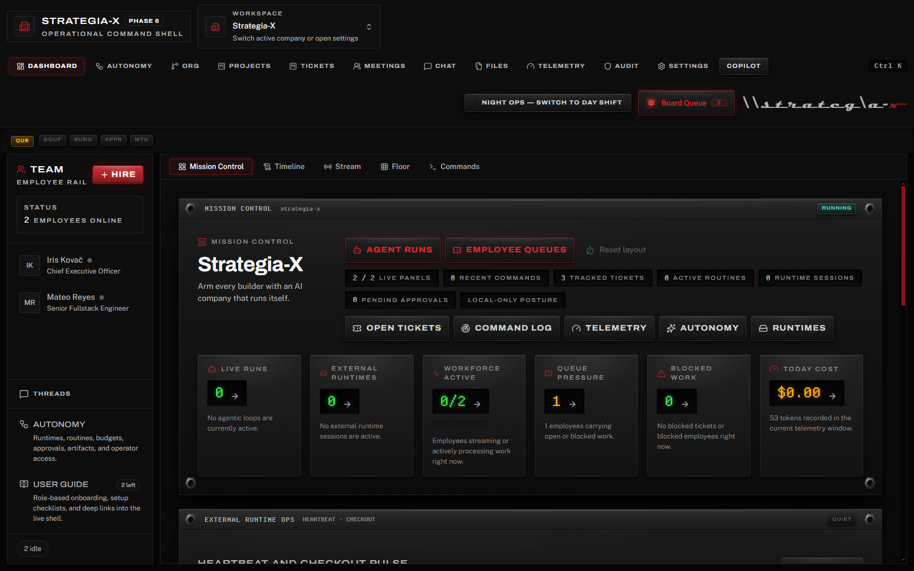
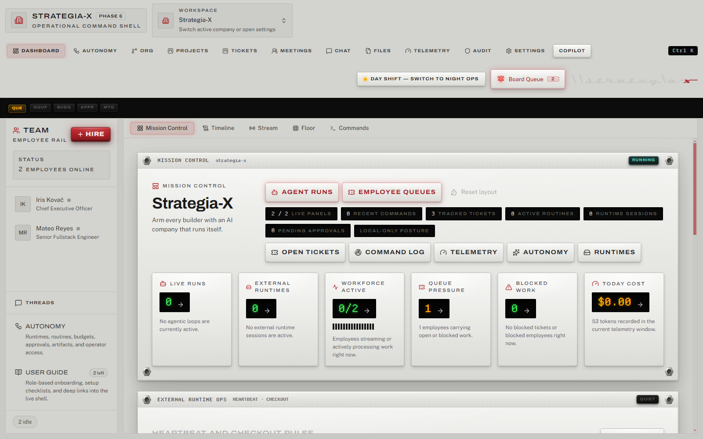

<div align="center">

# Team-X

**Run an AI company. Not a prompt.**

[](https://github.com/Git-Rocky-Stack/Team-X/actions/workflows/ci.yml)
[](LICENSE)
[](#testing)
[](#installation)

Open-source, privacy-first, local-first desktop app for running AI-agent organizations. You don't manage prompts or pipelines — you run a **company**: hire employees from a curated role library, build an org chart with real hierarchy, set goals, break them into projects, file tickets, schedule future work, watch the team work in real-time, chat with anyone on demand, and pull everyone into an all-hands meeting with one click.

[Download](#installation) | [Quick Start](docs/user-guide/getting-started/quick-start.md) | [User Guide](docs/user-guide/README.md) | [Contributing](CONTRIBUTING.md) | [Changelog](CHANGELOG.md)



*Mission Control in **Night Ops**. The whole app is built on the Command Console design system — brushed-aluminum faceplates, phosphor LCD readouts, stencil word-lamps, and data-bound VU meters.*

</div>

---

## Features

### The Org

- **57 curated F10 roles** — 55 user roles across 6 hierarchy levels (Officer, Senior Management, Management, Supervisor, Lead, IC) plus 2 hidden system roles, hand-written role specifications, not generic templates
- **Multi-company workspace** — run multiple AI organizations side-by-side, each with its own employees, goals, and settings
- **Org chart editor** — drag-to-rearrange reporting lines, promote, fire, set managers, edit employee profiles, visualize the full hierarchy with color-coded levels
- **Hire dialog** — searchable role catalog with level filter chips, one-click hiring from the curated pack

### The Live Cockpit

- **Mission Control dashboard** — five subviews: Mission Control (live ops stats, queues, runs, runtime heartbeats), Timeline (event feed), Stream (raw LLM output), Floor (employee activity grid), Commands (palette history with intent labels)
- **Annunciator rail** — five real signal lamps (QUE / GGUF / BUDG / APPR / MTG) with a master-caution acknowledge ritual: blinking means unacknowledged, click to ack, click again to teleport to the source view
- **Goals and projects** — set company-level goals with auto-derived progress meters, create projects with lead / priority / target date, track everything on a status kanban
- **Schedule and calendar** — a team week view plus agenda: manual tasks and reminders alongside automatic ticket due dates, project targets, goal targets, overdue counters, and assigned agent wakeups
- **Ticket kanban** — 4-column board (Open, In Progress, Blocked, Done) with drag-to-move, a detail rail for participants / attachments / discussion / ticket memory, and automatic agent assignment
- **One-click meetings** — call an all-hands with selected attendees, interject mid-meeting, auto-generated minutes with action item extraction
- **Real-time telemetry** — company stats, daily usage charts, per-employee breakdown, cost analysis by provider and model with date range filtering plus Work / Agentic / Copilot run-kind filters

### The Command Console design system

Team-X's interface is a purpose-built hardware design language — **Command Console / Carbon Pro** — modeled on professional broadcast and DJ gear rather than generic SaaS chrome:

- **Dual-shift theming** — **Night Ops** (brushed black aluminum, default) and **Day Shift** (silver anodized), switchable from the top bar. Displays stay void-black in both shifts, exactly like real silver hardware keeps black LCDs
- **Stencil word-lamps** — status is a word in a lamp tile (`GO / HOLD / NO-GO / STBY / EXEC`), never an ambiguous icon or colored dot
- **Functional instrumentation** — LCD readouts and VU meters are data-bound only (queue pressure, goal progress, workforce utilization); nothing blinks or glows for decoration
- **The dual-form red rule** — steady red means LIVE / armed / command authority; blinking red is a question that demands an answer



*The same dashboard in **Day Shift** — silver chassis, displays stay dark.*

### Autonomy control plane

A full operator console for governed autonomous work (the **Autonomy** tab, 10 subviews):

- **Doctor** — pre-flight health workflow: DB integrity, recovery readiness, runtime posture, secrets, provider/MCP health, budget blockers
- **Benchmarks** — replay deterministic autonomy scenarios and inspect pass rates, recovery timing, duplicate-work prevention, and spend
- **Runtime profiles & operations** — bind execution profiles (internal / local / external agents) to employees; watch live heartbeats and ticket checkouts
- **Routines** — recurring operating loops that materialize into explicit, auditable ticket runs
- **Budgets** — spend governance with warnings, hard caps, escalation thresholds, and a full ledger across company / employee / runtime / routine scopes
- **Approvals** — one unified decision inbox for authority, planner, budget, and routine decisions
- **Artifacts, Memory, Access, Improve** — runtime evidence, thread digests + resumable checkpoints, operator/sharing posture, and a self-improvement loop that opens deduped correction tickets from recent failure signals

### AI Runtime

- **9 LLM providers** — Ollama (local), Anthropic, OpenAI, Google Gemini, Groq, OpenRouter, Together AI, Fireworks AI, plus any OpenAI-compatible endpoint
- **Privacy tiers** — Local, Open-Source Cloud, Proprietary Cloud — filter which providers your agents can use
- **Adaptive runtime strategy** — Auto, Hybrid, Always-On, or Lean mode based on a live hardware profile (CPU cores, RAM, GPU, VRAM shown in Settings)
- **MCP tool calling** — agents use Model Context Protocol tools via a singleton host with connection pooling and `tools_allowed`/`tools_denied` enforcement
- **Skills & authority** — install skills from a local folder or GitHub URL, import MCP servers from templates or manual config, and govern everything through authority grants and per-employee permissions
- **Employee-to-employee messaging** — agents communicate with colleagues via built-in tools, forming collaborative workflows
- **Local GGUF foundation** *(in development)* — a complete native local-model backend (`@team-x/local-gguf-runtime`: GPU probing across CUDA / ROCm / Vulkan / Metal / CPU, llama.cpp server lifecycle, LRU model pool, GGUF metadata parsing, Hugging Face downloads, folder watching, benchmarking) ships in the codebase today; the model-library UI lands in a future release. Until then, local models run through Ollama

### Intelligence Layer

- **RAG-grounded agent turns** — every agent prompt is augmented with retrieved context from messages and vault files via the `@team-x/intelligence` package (sqlite-vec embeddings, token-aware chunking with overlap, cosine-threshold gating, SHA256-dedup attribution blocks)
- **Natural-language command palette** (`Cmd+K`) — 14 structured intents (hire / fire / promote / assign / create / close / reopen / project / goal / meeting / status / navigation / vault search) plus a `complex_request` fallback that hands off to the agentic loop. LLM-backed classifier with JSON-output retry, fuzzy entity resolution, FTS5 ticket lookup, destructive-action confirmation gate, last-20 command history
- **Agentic loop for complex questions** — ask free-form questions like *"why is the frontend team behind schedule?"* and get a grounded multi-paragraph answer citing specific tickets, employees, and events. Runs a ReAct-style loop on a hidden `system-agent` pseudo-employee, dispatches six read-only query tools, and terminates under hard step / token / wall-clock budgets (defaults 8 / 8000 / 120s — configurable in Settings → Agentic Loop)
- **Live step log + persisted thread** — the palette streams each loop step as a labeled card (plan → tool call → tool result → answer) with provider and token footer; full transcripts persist for later reference, and every run can be canceled mid-flight
- **Task Planner (write-side)** — Management-and-above agents can decompose projects into tickets, delegate subtasks with deterministic workload scoring, and review deliverables. Level-gated tool injection, an amber confirmation gate before any ticket is created, and four clamped guardrail settings in Settings → Task Planner
- **Copilot (proactive analyst)** — a hidden `system-copilot` employee analyzes the company on a 5-minute cadence (plus event triggers) and surfaces insights across five categories (`operational` / `cost` / `org` / `workflow` / `anomaly`) with three severities. Deterministic dedup, dismissal-feedback weight tuning (advisory by default, self-tuning opt-in), and zero phone-home — analysis runs on whatever provider you've configured
- **Copilot UI** — right-side sidebar (`Cmd+Shift+K`, Sparkles toolbar button, or dashboard widget) with severity-sorted insight feed, category/severity filters, CSV/JSON export, action-suggestion buttons through the gated command pipeline, and an Ask-Copilot box that routes free-form questions through the agentic harness

### Ship-Ready

- **File vault + agent-created deliverables** — filesystem-backed blob storage with SHA256 integrity verification, FTS5 full-text search, ticket attachments, and employee-generated `txt` / `md` / `csv` / `json` / `html` / `docx` / `xlsx` / `pptx` outputs
- **One-click backup/restore** — full SQLite + vault archive with manifest validation
- **Append-only audit log** — filterable event timeline with summary cards, actor search, date range picker, and CSV/JSON export
- **Workspace portability** — export a company as a template package, preview and import packages, share with a reviewed posture
- **In-app User Guide** — role-based onboarding (owner / operator / builder) with 22 sections, progress tracking, and deep links that jump straight into the referenced view or settings section
- **Cross-platform installers** — Windows (NSIS), macOS (DMG), Linux (AppImage + .deb) via electron-builder
- **User-triggered updates** — check for new versions from GitHub Releases on demand (zero phone-home)

---

## Installation

### Download

Grab the latest release for your platform from [GitHub Releases](https://github.com/Git-Rocky-Stack/Team-X/releases):

| Platform | File | Architecture |
|----------|------|--------------|
| Windows | `Team-X-Setup-x.x.x.exe` | x64, arm64 |
| macOS | `Team-X-x.x.x.dmg` | x64 (Intel), arm64 (Apple Silicon) |
| Linux | `Team-X-x.x.x.AppImage` / `.deb` | x64 |

> **Linux AppImage note:** the AppImage runtime requires **FUSE 2** (`libfuse2`; `libfuse2t64` on Ubuntu 24.04; `fuse-libs` on Fedora). If the AppImage won't start, either install that package or run `./Team-X-x.x.x-x64.AppImage --appimage-extract-and-run`. The `.deb` needs no FUSE and resolves its own dependencies (`sudo apt install ./Team-X-x.x.x-x64.deb`).

### From Source

```bash
# Prerequisites: Node.js 22.13+ (repo pins 22.22.2 via .nvmrc), pnpm 9+
git clone https://github.com/Git-Rocky-Stack/Team-X.git
cd Team-X
pnpm install
pnpm dev
```

### Local LLM Setup (Ollama)

Team-X works fully offline with local models. Install [Ollama](https://ollama.com), then:

```bash
ollama serve
ollama pull llama3.1:8b
```

Launch Team-X — it auto-detects the local Ollama instance.

### Cloud Providers

Add any supported provider in **Settings > AI Providers**: enter your API key, test the connection, and toggle it on. Your keys are stored in the OS keychain (never in config files).

---

## Architecture

```
Team-X/
  apps/desktop/             Electron app
    src/main/               Main process (Node.js + TypeScript)
      db/                   SQLite + Drizzle ORM (38 migrations)
      ipc/                  Typed IPC handlers (195 registrations / 224 bridge methods)
      orchestrator/         Agent scheduler + event bus
      services/             Vault, backup, MCP host, providers, updater,
                            rag-indexer, command-service, agentic-loop,
                            copilot-analyzer, routine-service, budgets,
                            local-gguf (library / pool / runtime), heartbeat
    src/preload/            Context-isolated bridge (TeamXApi)
    src/renderer/           React 19 + Tailwind + shadcn/ui on the
                            Command Console design system (DESIGN.md)
      components/console/   Faceplate, LampTile, LcdWell, MetricTile,
                            VuMeter, AnnunciatorRail, ShiftToggle, Tag
      features/             audit, autonomy, chat, command, copilot,
                            dashboard, hire, meetings, memory, orgchart,
                            projects, settings, telemetry, tickets,
                            user-guide, vault, workspace
      hooks/                React Query hooks
      store/                Zustand app store
    e2e/                    19 Playwright specs / 26 cases
  packages/
    shared-types/           IPC contract types, event types, entities
    role-schema/            Role-spec parser + renderer + pack signing
    provider-router/        LLM provider registry + streaming adapters
    telemetry-core/         Cost calculation utilities
    intelligence/           RAG (chunker, embedding, retriever),
                            NLU (classifier, entity resolver, slot filler),
                            agentic loop (ReAct scheduler, tool registry)
    local-gguf-runtime/     GPU probe, llama.cpp lifecycle, LRU pool,
                            GGUF parser, HF hub client, benchmark runner
  role-packs/
    strategia-official/
      roles/                57 curated F10 roles across user + system levels
      roles/system/         Hidden system-agent + system-copilot role cards
```

### Key Design Decisions

- **Renderer is a pure view.** No direct LLM or MCP calls. Every interaction crosses the typed IPC bridge.
- **Orchestrator is the only scheduler.** Pause semantics (e.g., during meetings) are race-free because nothing dispatches without the orchestrator's consent.
- **MCP Host is a singleton.** One pool of connections shared across all agents — no N-client sprawl.
- **Storage is SQLite + filesystem.** Metadata in SQLite, blobs on disk, SHA256 integrity. File blobs never go in the database.
- **Provider router is the single LLM gateway.** Enforces privacy tiers, concurrency caps, and cost tracking in one place.
- **Events table is append-only.** Source of truth for the real-time dashboard and audit log.
- **The design system is law.** Every surface follows `DESIGN.md` (Command Console / Carbon Pro): four-layer hardware depth, dual-shift theming, displays-stay-dark, data-bound instrumentation only.
- **Zero phone-home. Ever.** No telemetry, no analytics, no auto-update checks. Updates are explicitly user-triggered.
- **Secrets live in the OS keychain** via keytar. Never in config files.

---

## Tech Stack

| Layer | Technology |
|-------|-----------|
| Desktop shell | Electron 31 |
| Build | electron-vite + electron-builder |
| Main process | Node.js 22 + TypeScript (strict) |
| Renderer | React 19 + TypeScript + Tailwind CSS + shadcn/ui + Radix |
| Design system | Command Console / Carbon Pro (`DESIGN.md`) — Archivo, Public Sans, Departure Mono, Iosevka |
| State management | Zustand + React Query |
| LLM integration | Vercel AI SDK + provider packages |
| Agent framework | Custom orchestrator (not LangChain/CrewAI) |
| MCP | @modelcontextprotocol/sdk |
| Local models | Ollama today; `@team-x/local-gguf-runtime` (llama.cpp `b9371`) foundation for native GGUF |
| Database | better-sqlite3 + Drizzle ORM (38 migrations) |
| Full-text search | SQLite FTS5 |
| Secrets | keytar (OS keychain) |
| Package manager | pnpm workspaces |
| Lint / format | Biome + ESLint |
| Unit tests | Vitest (3,521 tests / 296 files) |
| E2E tests | Playwright (19 specs / 26 cases) |
| CI | GitHub Actions (Ubuntu + macOS + Windows + Electron E2E smoke) |

---

## Documentation

Team-X includes comprehensive documentation across 50+ files:

### Getting Started
- **[Quick Start Guide](docs/user-guide/getting-started/quick-start.md)** — 15-minute setup walkthrough for new users
- **[Getting Started](docs/user-guide/getting-started.md)** — first company, first hire, first ticket
- **[Comprehensive User Guide](docs/user-guide/comprehensive-user-guide.md)** — complete product documentation
- **In-app User Guide** — role-based onboarding with progress tracking, built into the app (left rail → User Guide)

### Reference
- **[FAQ](docs/user-guide/faq.md)** — frequently asked questions
- **[Troubleshooting](docs/user-guide/troubleshooting.md)** — common issues and solutions
- **[Glossary](docs/user-guide/glossary.md)** — term reference
- **[Keyboard Shortcuts](docs/user-guide/keyboard-shortcuts.md)** — the real shortcut surface
- **[CLI Reference](docs/user-guide/cli-reference.md)** — command palette and CLI tool documentation

### Real-World Scenarios
- **[Product Development Lifecycle](docs/user-guide/scenarios/01-product-development-lifecycle.md)** — complete product workflow
- **[Cost Optimization Playbook](docs/user-guide/scenarios/02-cost-optimization-playbook.md)** — budget management
- **[Failure Recovery Workflows](docs/user-guide/scenarios/03-failure-recovery-workflows.md)** — Copilot-guided recovery
- **[Cross-Functional Collaboration](docs/user-guide/scenarios/04-cross-functional-collaboration.md)** — team coordination
- **[Autonomous Routine Governance](docs/user-guide/scenarios/05-autonomous-routine-governance.md)** — routine automation
- **[Multi-Workspace Operations](docs/user-guide/scenarios/06-multi-workspace-operations.md)** — multi-client workflows
- **[Shift Handoff Playbook](docs/user-guide/scenarios/07-shift-handoff-playbook.md)** — operator transitions

### Templates
- **[Templates](docs/user-guide/templates/README.md)** — handoff documents, meeting agendas, ticket templates, routine templates

### Developer
- **[Developer Reference](docs/developer-guide/api-reference.md)** — architecture, MCP server development, role pack format, internal IPC surface
- **[Integration Guide](docs/developer-guide/integration-guide.md)** — providers, MCP servers, and extension points
- **[Architecture](ARCHITECTURE.md)** · **[API Endpoints](API_ENDPOINTS.md)** · **[Database Schema](DATABASE_SCHEMA.md)** · **[Design System](DESIGN.md)**

### Advanced
- **[Migration Guide](docs/user-guide/migration-guide.md)** — switching from other tools
- **[Accessibility Guide](docs/user-guide/accessibility-guide.md)** — WCAG 2.1 compliance documentation

### AI Discovery
- **[llms.txt](docs/llms.txt)** — AI-optimized documentation index for LLM consumption
- **[long-llms.txt](docs/long-llms.txt)** — extended AI reference with comprehensive details

---

## Development

```bash
# Install dependencies (runs electron-rebuild postinstall)
pnpm install

# Start dev server with HMR
pnpm dev

# Run unit tests
pnpm test

# Run E2E tests (builds first)
pnpm -F @team-x/desktop test:e2e

# Typecheck all workspaces
pnpm typecheck

# Lint + format
pnpm lint
pnpm format
```

### Building Installers

```bash
pnpm dist          # Current platform
pnpm dist:win      # Windows NSIS (x64 + arm64)
pnpm dist:mac      # macOS DMG (x64 + arm64)
pnpm dist:linux    # Linux AppImage + .deb (x64)
```

### Database Migrations

```bash
pnpm -F @team-x/desktop exec drizzle-kit generate --name <snake_case_name>
```

See [CONTRIBUTING.md](CONTRIBUTING.md) for the full development guide.

---

## Testing

Team-X ships with **3,521 unit tests** across 296 files and **19 Playwright E2E specs** (26 cases):

| Spec | Coverage |
|------|----------|
| `smoke.spec.ts` | Boot, render employees, chat round-trip |
| `ticket-flow.spec.ts` | Create ticket, assign, agent reply |
| `meeting-flow.spec.ts` | Call meeting, interject, end, verify minutes |
| `vault-backup.spec.ts` | Vault upload, integrity check, backup create/verify |
| `rag-flow.spec.ts` | RAG retrieval and attribution in agent turns |
| `command-palette.spec.ts` | Cmd+K intent classification, destructive gate, history |
| `agentic-loop.spec.ts` | Complex-request agentic loop, step log, persisted thread |
| `task-planner.spec.ts` | Write-side planner, amber confirmation gate, decompose → delegate round-trip |
| `copilot-service.spec.ts` | Periodic analyzer tick, insight dedup, dismiss, ask-the-copilot, gate regression guards |
| `copilot-ui.spec.ts` | Sparkles toolbar toggle, sidebar + insight card, dismiss optimistic update, `Cmd+Shift+K` shortcut |
| `copilot-feedback.spec.ts` | Dismissal feedback, advisory weight suggestion, audit event, Settings weight display |
| `copilot-insight-export.spec.ts` | Sidebar category filter, company-scope JSON export, all-company CSV export |
| `phase-5-integration.spec.ts` | Cross-milestone stitch — RAG indexing, palette round-trip, write-side gate, copilot tick |
| `phase-6-integration.spec.ts` | Planner role-fit outcome, feedback apply, run-kind telemetry filters, local JSON export |
| `workspace-switcher.spec.ts` | Multi-company switcher, create/settings/archive/delete lifecycle, hire flow |
| `org-chart.spec.ts` | Org chart read-side, drag reporting-line reassignment, cycle rejection, promote/fire |
| `telemetry-kind-filter.spec.ts` | Per-kind telemetry totals for All, Copilot, and Work run buckets |
| `local-gguf-loading.spec.ts` | Local GGUF runtime settings, GPU inventory, pool status round-trips |
| `local-gguf-network-share-resilience.spec.ts` | Watch-folder disconnect/reconnect resilience over network shares |

All E2E specs run against a canned test-mode provider — no Ollama, no API keys, no network.

```bash
pnpm test              # Unit tests
pnpm -F @team-x/desktop test:e2e   # E2E (full build + Playwright)
```

---

## Privacy

Team-X is built with a privacy-first posture:

- **Local-first by default.** Runs entirely on local models (Ollama) with no cloud dependency.
- **Zero phone-home.** No analytics, no telemetry, no crash reporting, no auto-update checks.
- **OS keychain for secrets.** API keys are stored in the system keychain via keytar, never in plaintext config files.
- **Privacy tier filtering.** Choose which provider tiers (local, open-source cloud, proprietary cloud) your agents are allowed to use.
- **Your data stays yours.** All data lives in a local SQLite database and filesystem vault on your machine.

---

## Contributing

We welcome contributions. See [CONTRIBUTING.md](CONTRIBUTING.md) for development setup, PR guidelines, coding standards, and the role-pack contribution guide.

---

## License

[MIT](LICENSE) &copy; 2026 [Rocky Elsalaymeh](https://github.com/strategia-x)
